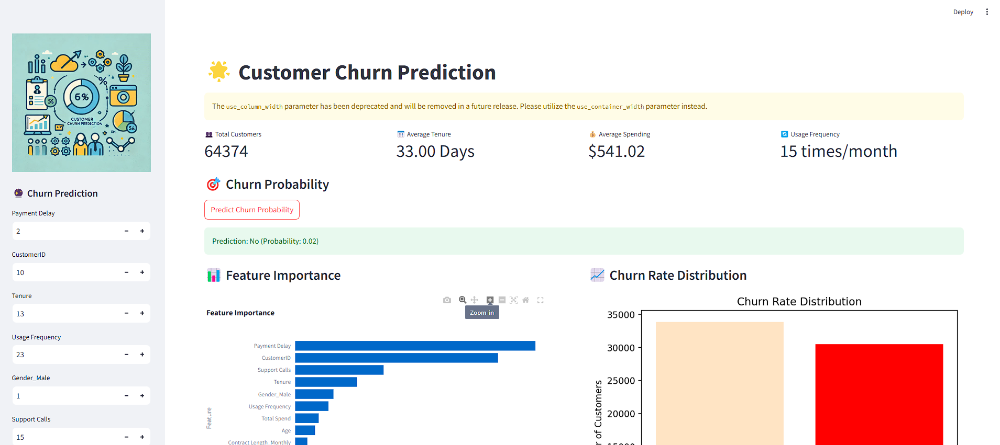
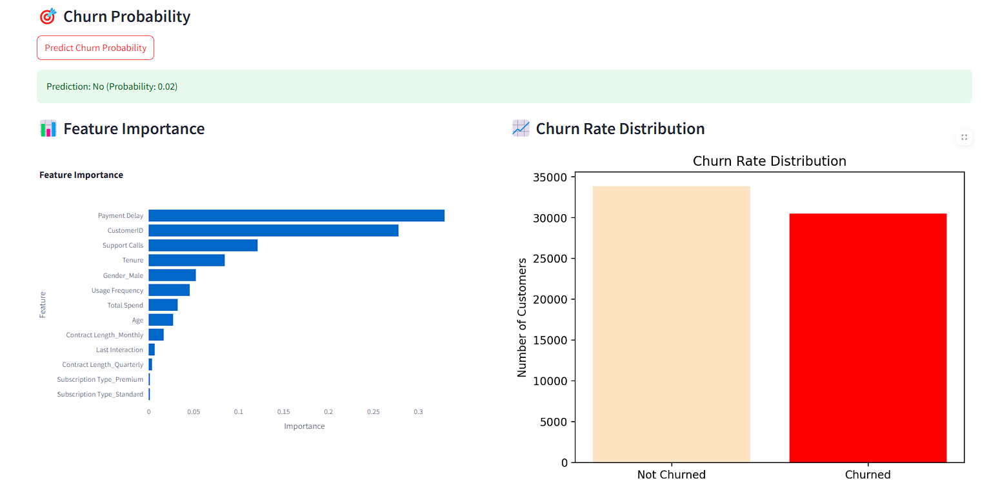
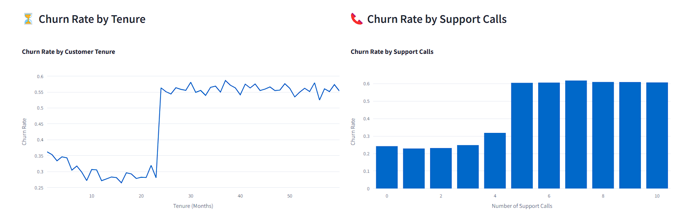
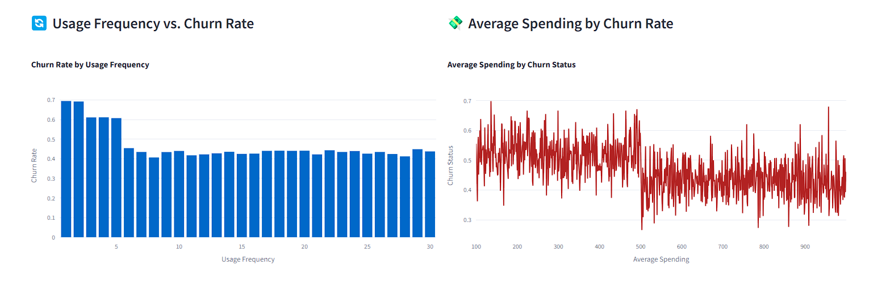

# Customer Churn Prediction

## Overview
This project predicts customer churn using machine learning techniques. It identifies customers likely to leave a business, enabling targeted retention strategies. The interactive dashboard provides key insights, including churn probability, feature importance, and usage patterns.



## Features
- **Churn Probability**:
- Predicts whether a customer will likely churn, with a probability score.
- **Interactive Dashboard**:
- Displays customer data insights, including:
- Total customers.
- Average tenure.
- Average spending.
- Usage frequency.
- Predicts churn probability based on input parameters such as payment delay, tenure, support calls, etc.
- **Visualizations**:
- Feature Importance: Highlights factors influencing churn.
- Churn Rate Distribution: Compares churned vs. non-churned customers.
- Churn Rate by Tenure and Support Calls.





## Installation
1. Clone the repository.
2. Install the required Python libraries:
```bash
pip install -r requirements.txt
```
3. Place the necessary data files (`data_with_prediction.xlsx`, `feature_importances.xlsx`) in the appropriate directory.
4. Run the Streamlit app:
```bash
streamlit run main.py
```


## Technologies Used
- **Machine Learning**: Random Forest Model.
- **Programming**: Python.
- **Visualization**: Plotly, Matplotlib.
- **Dashboard**: Streamlit.
- **Development Environment**: Jupyter Notebook.

## Dashboard Highlights
- **Churn Prediction**: Input customer parameters like payment delay, tenure, and support calls to predict churn probability.
- **Feature Importance**:
- Key factors include Payment Delay, Support Calls, and Tenure.
- **Churn Rate by Metrics**:
- Shows churn behavior based on tenure and frequency of support calls.
 

  

## Team
- **Ankit Kumar (Team Lead)**
- **Rahul Gupta**

## License
[Add your license details here, e.g., MIT, Apache 2.0]

## Contact
- **Ankit Kumar**: ak5035608@gmail.com
- **Rahul Gupta**: rg15112001@gmail.com
